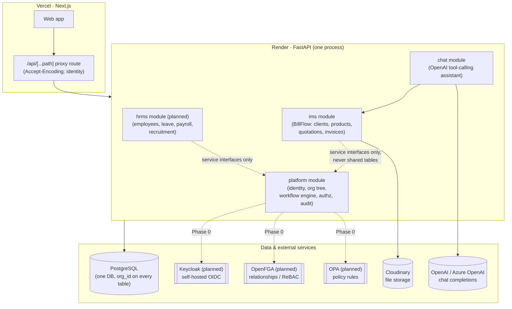
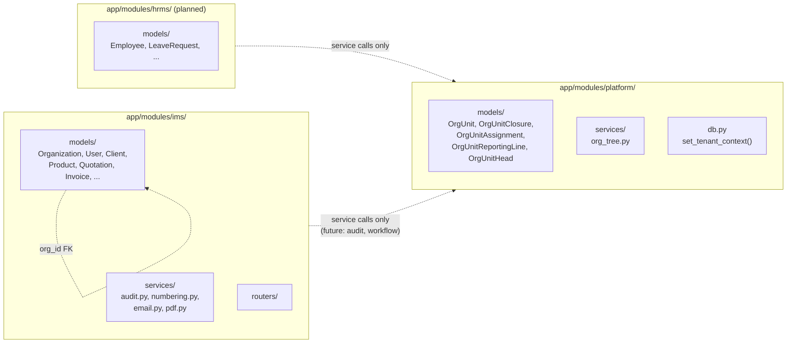
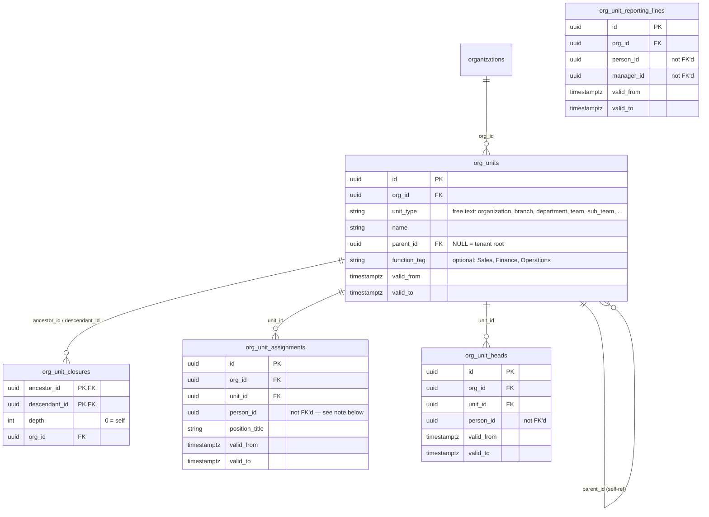
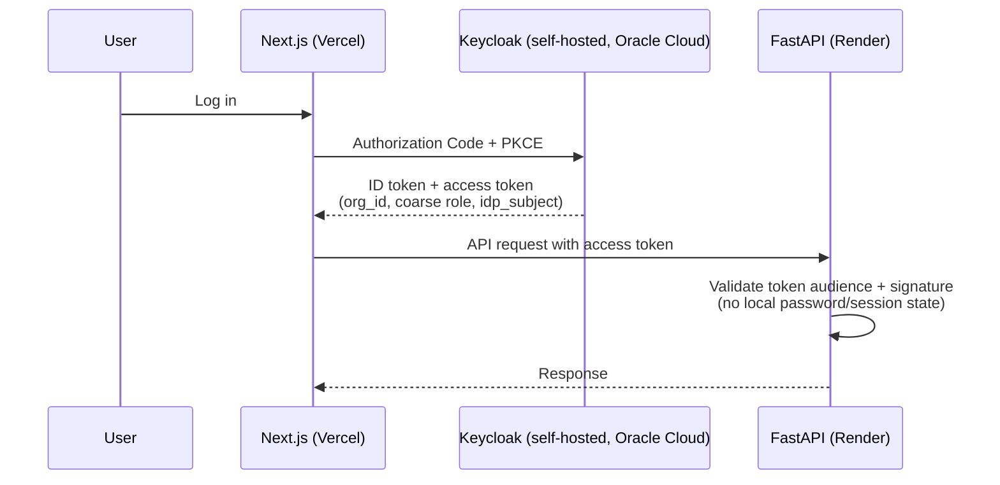
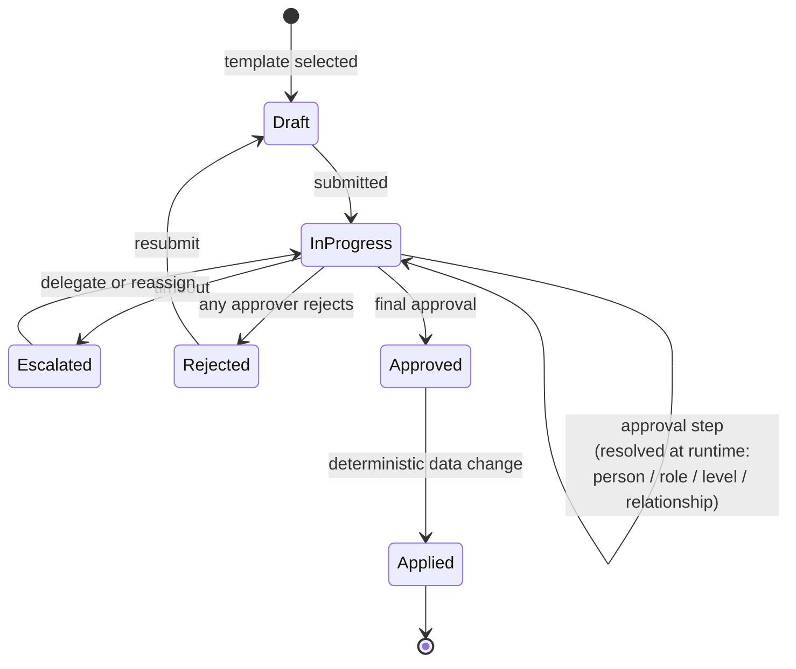
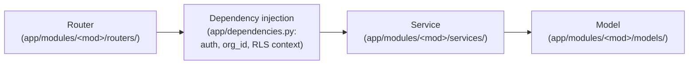

# Astrynox ERP — Architecture

This document describes how Astrynox ERP is built today and where it's headed. It is
derived from [`docs/prd.md`](./prd.md) (the source of truth for the HR module and
platform core — **never edit that file**; it's maintained outside the repo) and from
the codebase as it stands. Unlike `prd.md`, this file lives in the repo and should be
kept in sync as the platform core and HR module land.

For execution order and status, see [`docs/implementation-plan.md`](./implementation-plan.md).

---

## 1. System overview

Astrynox ERP is a **multi-tenant SaaS ERP built as a modular monolith**: one FastAPI
app, one PostgreSQL database, one deploy unit. Tenancy and module boundaries are
enforced in code and in the database (row-level security), not by splitting services.

| Module | Status | Owns |
|---|---|---|
| **BillFlow** (`app/modules/ims/`) | Live | Clients, products, quotations, invoices, org/user management, the in-app chat assistant |
| **Platform core** (`app/modules/platform/`) | In progress | Identity, org tree, workflow engine, authorization, audit — shared services every module uses |
| **HRMS** (`app/modules/hrms/`, planned) | Not started | Employee records, attendance/leave, payroll, recruitment, onboarding |



---

## 2. Module boundaries

All modules live under `app/modules/<name>/` with the same internal shape
(`models/`, `services/`, `routers/`, `schemas/`). The rule from `CLAUDE.md`:

> Modules talk through each other's service interfaces, never each other's tables
> directly.

Today only `ims` and `platform` exist as code. `platform` does not import `ims`
models, and `ims` does not import `platform` models beyond FK'ing `org_id` to the
shared `organizations` table (which conceptually belongs to platform's identity
domain but currently lives in `ims` for historical reasons — see
[§7 Known debt](#7-known-debt-and-open-decisions)).



---

## 3. Multi-tenancy & data isolation

`Organization` is the tenant. Every table carries `org_id`. Two enforcement
mechanisms coexist during the migration to the platform core:

| | Legacy (`ims` tables) | New (`platform`/`hrms` tables) |
|---|---|---|
| Isolation mechanism | App-level filtering — every query manually filters by `current_user.org_id` | **Postgres row-level security (RLS)**, enforced at the database |
| Enforced by | `app/dependencies.py::get_current_user()` + router/service code discipline | RLS policy per table, `SET LOCAL app.current_org_id` per transaction |
| Tested against | SQLite | Postgres only (SQLite has no RLS) |

New tables (platform, HR) get RLS from day one, per `CLAUDE.md`:

> New tables also get Postgres row-level security policies.

**How it works** (see `app/modules/platform/db.py` and any
`alembic/versions/*_add_platform_*.py` migration):

1. Every platform table is created with `ENABLE ROW LEVEL SECURITY` and
   `FORCE ROW LEVEL SECURITY`, plus a policy:
   ```sql
   CREATE POLICY <table>_tenant_isolation ON <table>
   USING (org_id = NULLIF(current_setting('app.current_org_id', true), '')::uuid)
   WITH CHECK (org_id = NULLIF(current_setting('app.current_org_id', true), '')::uuid);
   ```
2. `set_tenant_context(db, org_id)` runs `SET LOCAL app.current_org_id = '<uuid>'`
   for the current transaction. No-op on SQLite.
3. If the context is never set, `current_setting(...)` reads `NULL`/`''`, the
   policy matches nothing, and the query returns zero rows — **fails closed**.
4. The application's runtime DB role must **not** be a Postgres superuser and must
   not have `BYPASSRLS` — both bypass RLS unconditionally, silently defeating it.

This mechanism is still only wired into service-layer code and tests
(`tests/platform/conftest.py::as_tenant`); request-level middleware that calls
`set_tenant_context()` on every inbound request has not been built yet (see
implementation plan, "Access-management UI" milestone).

---

## 4. Org tree (built — Phase 0, milestone 0.1)

The org tree is a **pure tree** — Organization → Branch → Department → Team → Sub
Team — implemented as one flexible table plus a closure table, per `docs/prd.md`
§"Org structure".



Key design points (all from `docs/prd.md`, implemented in
`app/modules/platform/models/` and `app/modules/platform/services/org_tree.py`):

- **One flexible tree.** `unit_type` is free text, not a DB enum — new level types
  (Region, Division, ...) need no schema change. The root row (`parent_id IS NULL`)
  represents the organization itself; a partial unique index enforces exactly one
  root per `org_id`.
- **Closure table for subtree queries.** `org_unit_closures` holds one row per
  `(ancestor, descendant)` pair (including a depth-0 self row), materializing the
  *current* tree shape. `org_tree.create_unit()` seeds it; `org_tree.move_unit()`
  runs the standard closure-table detach/reattach algorithm to keep it consistent
  across reparenting.
- **Reporting lines are separate from tree position.** "My manager" comes from
  `org_unit_reporting_lines`; "head of my department" comes from `org_unit_heads`.
  Neither is derived by walking `parent_id`.
- **Function tags** are optional and free text, so reports roll up across branches
  regardless of tree position (e.g. all "Engineering"-tagged units company-wide).
- **Effective dating everywhere.** `org_units`, `org_unit_assignments`,
  `org_unit_reporting_lines` and `org_unit_heads` all carry `valid_from`/`valid_to`
  instead of being overwritten. `org_tree.get_subtree_ids(..., as_of=...)` and the
  `get_*_as_of()` lookups answer "what did this look like on date X."
- **`person_id` is deliberately not a foreign key.** Per `docs/prd.md`: *"a user is
  not an employee: some employees never log in, and records exist before accounts
  during onboarding."* These columns will point at `hrms.employees.id` once that
  table exists.

This closure table (not `ltree`) was chosen as the "fast subtree queries" mechanism
`docs/prd.md` names as an option — see
[§7 Known debt](#7-known-debt-and-open-decisions) for why.

---

## 5. Identity & auth

**Current (BillFlow only, `app/modules/ims/`):** in-app JWT.

- Access/refresh tokens issued as HttpOnly cookies, also accepted as
  `Authorization: Bearer`.
- Refresh tokens are SHA-256 hashed before storage in `user_sessions`; rotated on
  every refresh (old session revoked before the new one issues).
- Four invoicing-only roles (`SUPER_ADMIN`, `ACCOUNTANT`, `SALES`, `VIEWER`) on
  `app/modules/ims/models/user.py::UserRole`, enforced via `app/dependencies.py`
  guards (`get_super_admin`, `get_sales_or_admin`, etc.).

**Target (per `docs/prd.md`) — Keycloak replaces this outright, not incrementally:**



- One `astrynox` realm, using Keycloak's **Organizations** feature — each tenant is
  one Keycloak organization with its own SSO connection.
- Clients: Next.js (auth code + PKCE), FastAPI (token audience only), and a backend
  service account limited to creating/disabling users.
- Tokens carry identity, `org_id`, and **coarse roles only** — fine-grained access
  is OpenFGA's job, not the token's.
- `users.idp_subject` is added to link local user rows to Keycloak identities.
  The four invoicing-only roles stay as-is for BillFlow; HR does not add roles to
  that enum — HR permissions are Keycloak coarse roles + OpenFGA scopes.
- Realm/clients/mappers managed as code (keycloak-config-cli or Terraform), login
  theme via Keycloakify.

This is an outright replacement because, per `docs/prd.md`: *"the invoicing module
has no users to migrate."*

---

## 6. Authorization (planned — OpenFGA + OPA)

Two engines, split by concern:

- **OpenFGA** answers *who is related to whom*: RBAC (roles as relationships), ReBAC
  (inheritance down the org tree), ABAC (conditions like grade limits). The tenant
  admin UI presents this as "role + scope" (e.g. "HR Officer for the Kandy branch").
- **OPA/Rego** answers *is this action allowed*: validates tenant template tweaks,
  enforces workflow invariants (no self-approval — already enforced at the DB level
  for reporting lines via a `CHECK (person_id <> manager_id)` constraint, but OPA
  will cover the general workflow-approval case), and gates every AI-proposed action
  before execution. Rego is dev-team-authored and version-controlled; tenant config
  is data OPA evaluates, never code tenants write.

The org tree maps to one recursive OpenFGA type (from `docs/prd.md`, reproduced
here since it's the contract the platform's org tree was built to satisfy):

```
type org_unit
  relations
    define parent: [org_unit]
    define head: [user]
    define hr_officer: [user] or hr_officer from parent
    define viewer: [user] or viewer from parent or hr_officer
```

`org_unit.parent` and `org_unit.head` map directly onto `org_units.parent_id` and
`org_unit_heads`, kept in sync via an **outbox pattern** (org data changes and
OpenFGA relationship-tuple writes commit together, so restructures never leave stale
access) — not yet built.

List views filter by a precomputed scope in SQL (using the closure table, already
built); OpenFGA handles individual permission checks. Salary visibility and the
audit log require explicit grants and never inherit by accident.

---

## 7. Workflow engine (planned)

One engine drives every HR request type (leave, document requests, promotions,
transfers, resignations, terminations) as configuration, not separate features.



Implementation per `docs/prd.md`: a state machine in Postgres (`definitions`,
`instances`, `step_instances`, `actions`) plus a job queue for timers/escalations —
no external orchestrator. Approvers are resolved at runtime (specific person, role,
level, or relationship — e.g. "reporting manager," which reads
`org_unit_reporting_lines`, already built), never stored as fixed user IDs.

Tenant superadmins may only add approval steps, change approvers, and add
conditional rules that add approvals — never alter locked parts (step types, the
final data change, mandatory steps, risk tier). Tenant tweaks are stored as overlays
on a specific template version so upgrades re-apply them; in-flight requests stay on
the version they started with.

AI involvement is tiered by risk (`docs/prd.md` §"AI autonomy model"); tier 3
actions (promotions, salary changes, terminations, ...) can never be fully
automated, in line with GDPR Article 22. Every AI-proposed action passes an OPA
check before executing.

---

## 8. Request lifecycle

Unchanged across modules — this is the pattern both `ims` and `platform`/`hrms`
follow:



Routers handle HTTP concerns only. Cross-model business logic lives in services.
Audit logging is called **after** the main commit, as the last step
(`log_action()` in `ims`; the platform module's shared audit log — planned — will
generalize this).

---

## 9. AI / chat layer

**Live today (BillFlow only):** `app/chat/` — an OpenAI tool-calling assistant over
invoicing data (`app/chat/service.py`, `tools.py`). Every tool executor filters by
`org_id` server-side (never accepted as a model-controllable parameter), returns a
plain `dict` (never raises), and caps list results (`MAX_RESULTS = 50`).

**Planned:** migrate `service.py` from `openai.OpenAI(...)` to
`openai.AzureOpenAI(...)` for enterprise data compliance (DPA, no training on org
data, data residency) — see `CLAUDE.md` for the exact env var changes. This is
independent of the HR/platform work and can land anytime.

The HR module's future AI layer (autonomy tiers, OPA-gated proposals) is a separate,
larger surface — not yet designed beyond the tier table in `docs/prd.md`.

---

## 10. Deployment

| | |
|---|---|
| Backend | Render, deployed via GitHub push; Dockerfile auto-detected at repo root |
| Frontend | Vercel (Next.js); never calls the backend directly — goes through `app/api/[...path]/route.ts`, which sets `Accept-Encoding: identity` (removing it breaks response bodies via Vercel — see `CLAUDE.md`) |
| Database | PostgreSQL (Render or equivalent) |
| Keycloak (planned) | Self-hosted, Oracle Cloud Always Free ARM tier for the pilot; dedicated Postgres, TLS reverse proxy, nightly off-machine backups; move to paid hosting once there are paying tenants |
| CI | GitHub Actions (`.github/workflows/ci.yml`): SQLite for the general suite, plus a `postgres:16-alpine` service so `tests/platform/` (RLS, closure-table) tests run instead of skipping |
| Local dev | `docker-compose.yml` (Postgres + backend with `--reload`) — dev-only; production uses the plain Dockerfile CMD |

---

## 11. Testing strategy

| Code | DB | Why |
|---|---|---|
| `ims` (BillFlow) | SQLite (`tests/conftest.py`) | No Postgres-only features used; fast, no external service needed |
| `platform` / `hrms` | **Postgres only** (`tests/platform/conftest.py`, `pytest.mark.postgres`) | RLS and (if used later) `ltree` have no SQLite equivalent |

Postgres-marked tests skip themselves cleanly (`pytest.skip`) when
`PLATFORM_TEST_DATABASE_URL` isn't reachable, so `pytest tests/` always passes
locally without Postgres running — but CI always runs them against a real service
container. Any new platform/HR table migration must be validated with `alembic
upgrade head` against real Postgres, not just SQLite `create_all()`, since RLS
policies are raw SQL (`op.execute(...)`) that SQLite silently can't express.

---

## 12. Known debt and open decisions

- **`organizations` and `users` currently live in `app/modules/ims/`,** not
  `platform/`, even though identity conceptually belongs to the platform core per
  `docs/prd.md`'s module list (`platform/`, `invoice/`, `hrms/`). Moving them is a
  larger refactor (touches every `ims` FK) and hasn't been scheduled — tracked in
  the implementation plan as a Phase 0 decision, not yet started.
- **`ims` is BillFlow's actual module directory name**, not `invoice/` as
  `docs/prd.md`'s architecture line names it. Treated as a naming variance, not a
  contradiction to resolve now — renaming a live module is disruptive for no
  functional gain; if it happens, it should be its own isolated PR.
- **RLS request-context wiring is not yet automatic.** `set_tenant_context()` exists
  and is proven in tests and service-layer code, but no FastAPI dependency sets it
  on every request yet. Needed before any platform/HR router goes live.
- **Closure table vs `ltree`:** `docs/prd.md` offers both as options for "fast
  subtree queries." Closure table was chosen because it makes move/reparent
  operations (`org_tree.move_unit()`) simpler to express and test in pure SQL/ORM,
  at the cost of one extra join table; `ltree` would need a Postgres extension and
  path-string maintenance on every move. Revisit if subtree query performance
  becomes a bottleneck at higher scale (PRD's 100–300 employee second pilot).
