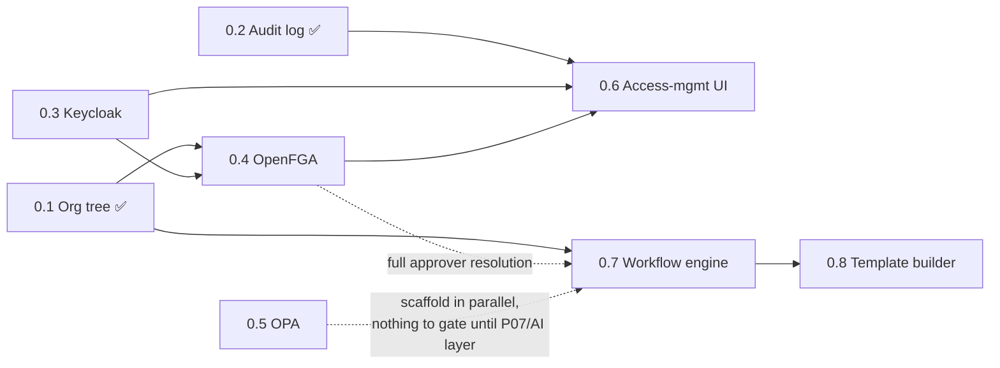

# Astrynox ERP — Implementation Plan

This turns `docs/prd.md`'s Phase 0 outline and five-phase roadmap into a sequenced,
trackable engineering plan for this repo. `docs/prd.md` remains the source of truth
for *what* and *why*; this document tracks *status* and *order*, and should be
updated as work lands (unlike `prd.md`, which is never edited here). See
[`docs/architecture.md`](./architecture.md) for how the pieces fit together.

Status legend: ✅ Done · 🔶 In progress · ⬜ Not started

---

## Phase 0 — Platform core

Everything HR needs before HR-specific work can start. Ordered by dependency, not
by number — items without a dependency can be pulled forward in parallel.

### 0.1 — Org tree ✅ Done

`org_units`, `org_unit_closures`, `org_unit_assignments`, `org_unit_reporting_lines`,
`org_unit_heads`. Effective-dated, RLS-enforced, closure-table subtree queries.
Postgres-marked tests (subtree, as-of-date, RLS isolation). Merged: PR #35
(`feat/platform-org-units` → `dev`).

**Depends on:** nothing. **Blocks:** 0.4 (OpenFGA org_unit model needs real unit
IDs to write relationship tuples against), 0.7 (workflow engine's "reporting
manager" / "department head" approver resolution reads this directly).

### 0.2 — Platform audit log ✅ Done

A shared, generalized version of `ims`'s `log_action()` pattern
(`app/modules/ims/services/audit.py`), added to `platform/` so every module can
write through one audit trail (`ims`'s own audit log stays as-is for BillFlow).

**Delivered:**
- `platform/models/audit_log.py` — `PlatformAuditLog` (named to avoid colliding
  with `ims`'s existing `AuditLog` class in SQLAlchemy's shared declarative
  registry — see the model docstring). org_id, `actor_type`/`actor_id`/
  `actor_label` (user, AI, or system — `actor_id` not FK'd, same rationale as
  `org_unit_assignments.person_id`), action, resource type/id, `before_data`/
  `after_data`/`extra_data`, timestamp. RLS enabled + forced, same policy pattern
  as the org tree tables.
- `platform/services/audit.py::log_action()` — sets its own RLS tenant context
  and commits independently, per the "call it last, after the main commit"
  convention in `CLAUDE.md`.
- Postgres-marked tests (`tests/platform/test_audit_log.py`): field persistence,
  AI/system actors, ordering, no orphaned row when the main action fails before
  logging, write isolation between two orgs, RLS fail-closed with no context, and
  raw-SQL cross-tenant insert rejection.

**Depends on:** nothing (doesn't need Keycloak, OpenFGA, or the org tree).

### 0.3 — Identity: Keycloak ⬜ Not started

Replaces in-app JWT auth outright (not incrementally — BillFlow has no users to
migrate, per `docs/prd.md`).

**Scope, roughly in sub-order:**
1. Stand up self-hosted Keycloak 26.x on Oracle Cloud Always Free ARM tier:
   dedicated Postgres, TLS reverse proxy, nightly off-machine backups, health
   monitoring, admin console not public, MFA on the admin account.
2. Define the `astrynox` realm, Keycloak **Organizations** (one per tenant),
   clients (Next.js auth-code+PKCE, FastAPI token-audience, backend service
   account), and token mappers — all as code (keycloak-config-cli or Terraform),
   versioned in git.
3. Keycloakify login theme.
4. Replace in-app auth in FastAPI (`app/dependencies.py::get_current_user` and
   friends) and Next.js with OIDC token validation. Add `users.idp_subject`.
5. Map existing tenants (`organizations` rows) to Keycloak organizations.

**Depends on:** nothing technically, but is infra-heavy (external hosting, DNS,
certs) and touches every authenticated endpoint in `ims` — budget it as its own
focused block of time, not interleaved with other work.
**Blocks:** 0.4 (OpenFGA relationships are keyed on real user identities), 0.6
(access-management UI needs real auth to build against).

### 0.4 — Authorization: OpenFGA ⬜ Not started

**Scope:**
- Stand up OpenFGA (hosting TBD — not yet decided where).
- Write the `org_unit` authorization model from `docs/prd.md` (parent / head /
  hr_officer / viewer relations — see `architecture.md` §6 for the exact model)
  plus an `employee` type once 0.9/HRMS employee records exist enough to reference.
- Outbox pattern: org tree changes (`org_tree.create_unit`, `move_unit`,
  `set_unit_head`) and OpenFGA relationship-tuple writes commit together, so
  restructures never leave stale access.
- Tenant admin UI presents this as "role + scope" (deferred to 0.6).

**Depends on:** 0.1 (done). Practically wants 0.3 (Keycloak) first for real user
IDs, though it can be scaffolded earlier against placeholder identities if needed.

### 0.5 — Policy rules: OPA ⬜ Not started

**Scope:** Rego policies for workflow invariants (no self-approval — partially
already enforced at the DB level via `org_unit_reporting_lines`'s
`CHECK (person_id <> manager_id)`, but OPA covers the general approval-chain case),
validation of tenant template tweaks, and the gate every AI-proposed action passes
before executing. Dev-team-authored, git-versioned, unit-tested; tenant config is
data OPA evaluates, never code tenants write.

**Depends on:** nothing blocking to *start* (Rego can be written and unit-tested in
isolation), but has nothing real to gate until 0.7 (workflow engine) and the AI
layer exist. Reasonable to scaffold in parallel with 0.7 rather than strictly after.

### 0.6 — Access-management UI ⬜ Not started

Tenant-facing UI: role + scope assignment, an "explain why this person can see this
record" view, audited permission changes (feeds SOC 2 controls later).

**Depends on:** 0.3 (Keycloak, for real users to assign roles to), 0.4 (OpenFGA, to
assign scopes into), 0.2 (audit log, to record changes).

### 0.7 — Workflow engine ⬜ Not started

State machine in Postgres: `definitions`, `instances`, `step_instances`, `actions`,
plus a job queue for timers/escalations. Drives leave, document requests,
promotions, transfers, resignations, terminations as configuration.

**Depends on:** 0.1 (done — approver resolution by relationship reads
`org_unit_reporting_lines`/`org_unit_heads` directly). Can start once 0.1 is in
place; doesn't strictly need 0.3/0.4 to build the state machine itself, but
"resolve approver by role/level" needs 0.4 (OpenFGA) to mean anything beyond a
placeholder, so full end-to-end approval routing is blocked on 0.4.

### 0.8 — Template builder ⬜ Not started

Internal no-code builder for workflow templates: structured JSON/YAML with schema
validation, visual preview in v1. Dev-team-authored templates; tenant superadmins
may only add approval steps, change approvers, and add conditional rules that add
approvals (never alter locked parts). Overlay storage per template version.

**Depends on:** 0.7.

---

### Phase 0 dependency graph

### Suggested next step

With 0.1 and 0.2 done, **0.3 (Keycloak)** is the real critical-path item: almost
everything else (0.4, 0.6, and meaningful end-to-end testing of 0.7) wants real
identity underneath it. It's also the most infra-heavy piece, so it's worth
scheduling as its own dedicated block rather than picked up incidentally.

---

## Independent, unblocked work

Not on the Phase 0 critical path — can be picked up anytime without waiting on
anything above.

### BillFlow chat tools (`app/chat/chat_tools.py`)

Fully scoped in `CLAUDE.md` already. Add `get_outstanding_amount`,
`get_overdue_invoices`, `get_quotations`, `get_quotation_summary`,
`get_client_summary`, `get_top_clients`, `get_clients`, `get_products` — each with a
`TOOL_DEFINITIONS` entry, an executor (org_id filtered, never raises, returns
`dict`, `LIMIT`ed), and registration in `execute_tool()`. Tests in
`tests/test_chat.py` per the mocking pattern already documented in `CLAUDE.md`.

### Azure OpenAI migration (`app/chat/service.py`)

Swap `openai.OpenAI(...)` → `openai.AzureOpenAI(...)`, add the three Azure env
vars. No changes needed to `tools.py`. Purely a compliance/infra change, zero
overlap with the platform work above.

---

## Phase 1+ — HR module proper

`docs/prd.md`'s five-phase roadmap (employee records & self-service → attendance &
leave → payroll → recruitment & onboarding → document requests & lifecycle
workflows, in dependency order) starts only once Phase 0 is functionally complete
enough to build on — specifically 0.1 (done), 0.3, 0.4, and 0.7 at minimum, since
employee records need real auth/authz and leave workflows need the workflow engine.

Detailed phase-by-phase planning for this is deferred until Phase 0's critical path
(0.2 → 0.3 → 0.4/0.7) is far enough along to know the real shape of what's left —
planning HR employee records against an auth system that doesn't exist yet would be
guesswork. This section will be expanded into the same level of detail as Phase 0
above once that point is reached.

---

## Testing & migration conventions (apply to every item above)

- Any new platform/HR table: `org_id` column + RLS policy (`ENABLE` + `FORCE ROW
  LEVEL SECURITY` + a `USING`/`WITH CHECK` policy scoped to
  `current_setting('app.current_org_id', true)`), following the pattern in
  `alembic/versions/n4o5p6q7r8s9_add_platform_org_units.py`.
- Postgres-only features (RLS, and anything like `ltree` if it's ever introduced)
  get tests under `tests/<module>/`, marked `pytest.mark.postgres`, using the
  `pg_engine`/`pg_session`/`as_tenant` fixture pattern from
  `tests/platform/conftest.py`. They must skip cleanly without a reachable
  Postgres and must actually run in CI (see the `postgres:16-alpine` service in
  `.github/workflows/ci.yml`) — a Postgres-marked test that only ever skips is as
  good as no test.
- Verify every new migration with a real `alembic upgrade head` /
  `downgrade -1` / `upgrade head` round-trip against Postgres before merging —
  `Base.metadata.create_all()` against SQLite will not catch broken RLS SQL.
