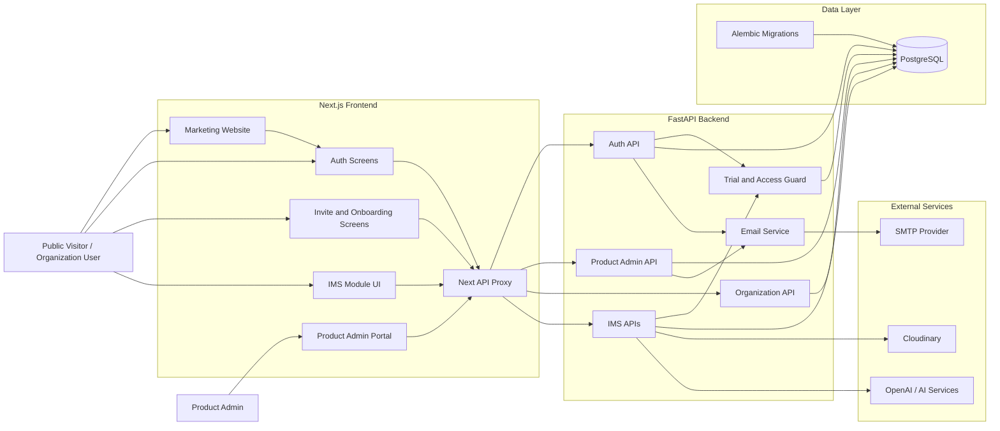
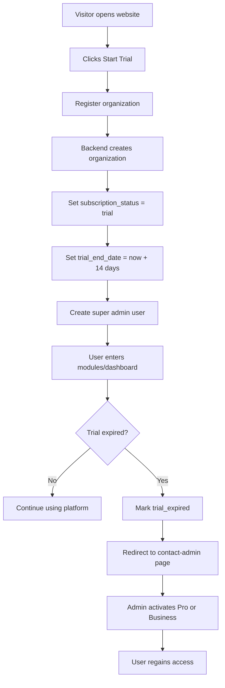
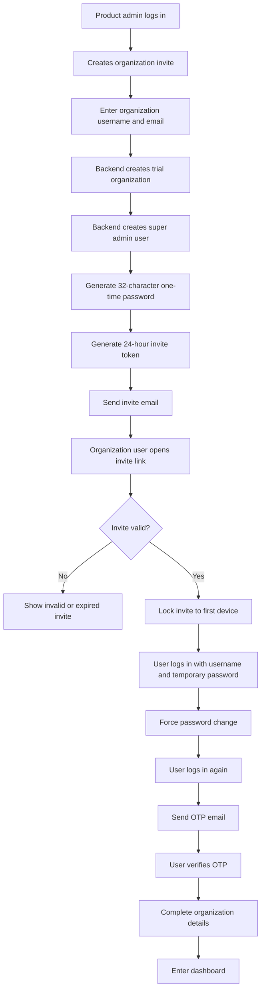
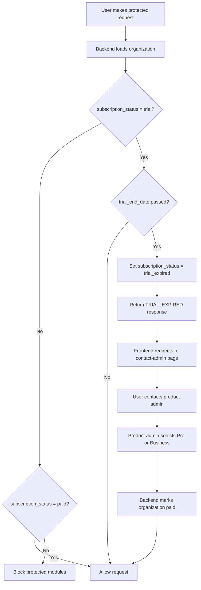
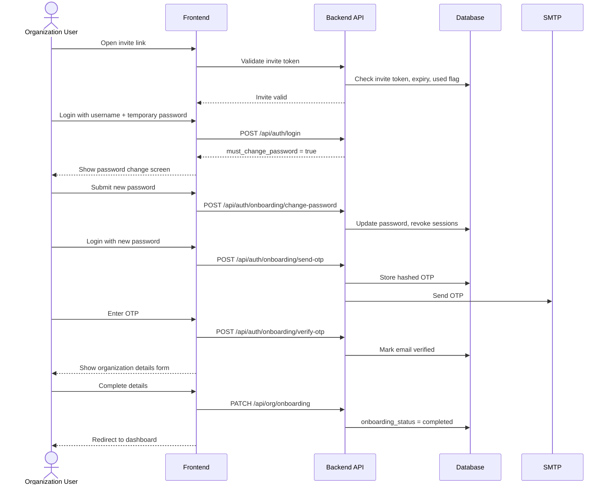
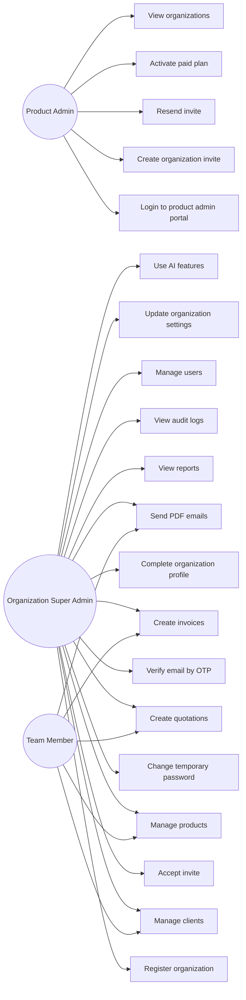
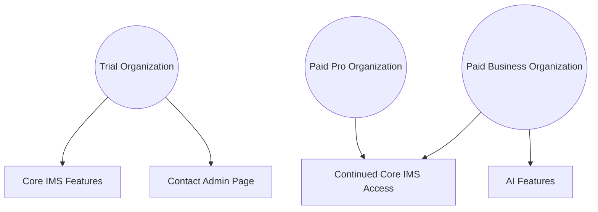
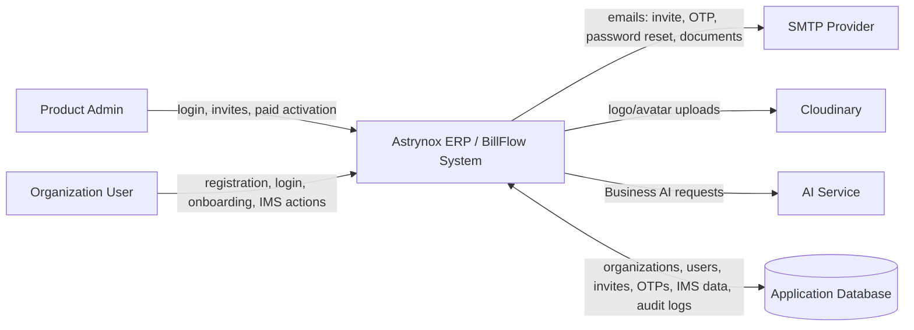
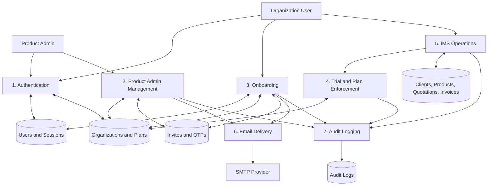
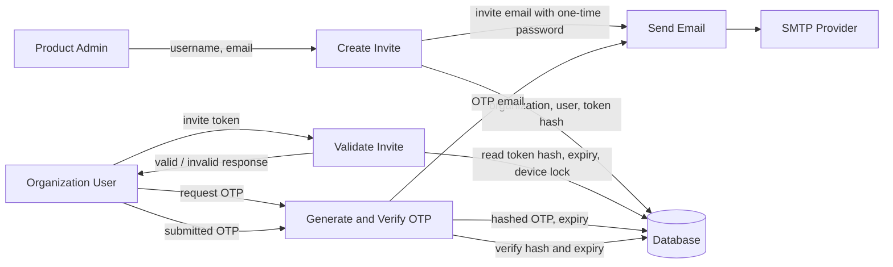

# Astrynox ERP / BillFlow Product Specification

## 1. Product Overview

Astrynox ERP currently provides an Invoice Management System under the BillFlow product experience. The platform supports organization-based workspaces where users can manage clients, products, quotations, invoices, reports, audit logs, organization branding, and team access.

The product now supports two organization onboarding paths:

- Public self-registration
- Product-admin invitation

Every organization starts with a 14-day trial by default. After the trial ends, platform access is limited until the product admin manually activates a paid plan.

## 2. Product Goals

- Allow organizations to start using the platform quickly with a 14-day trial.
- Allow the product admin to invite organizations directly using only username and registered email.
- Enforce a clear trial-to-paid conversion flow.
- Support two paid plans:
  - Pro: standard platform features without AI.
  - Business: standard platform features with AI features.
- Keep existing organization registration behavior available.
- Provide secure first-login onboarding for invited organizations.
- Preserve tenant isolation between organizations.

## 3. User Types

### Product Admin

The product admin manages platform-level organization access.

Current product admin identity:

- Email: `brayanjayawardhana@gmail.com`
- Password: configured through `PRODUCT_ADMIN_PASSWORD`

Product admin capabilities:

- Log into product admin portal.
- Create organization invites.
- Resend organization invites.
- View organizations.
- View organization trial/paid status.
- Activate paid plans.
- Choose Pro or Business plan.

### Organization Super Admin

The first user of an organization. This user can manage the organization workspace.

Capabilities:

- Complete onboarding.
- Manage organization settings.
- Manage users.
- Manage clients and products.
- Create quotations and invoices.
- Access reports and audit logs.

### Organization Team Members

Organization users with role-based permissions.

Supported roles:

- Super Admin
- Accountant
- Sales
- Viewer

## 4. Organization Lifecycle

### Statuses

Organizations use the following subscription statuses:

- `trial`
- `trial_expired`
- `paid`

Organizations also use onboarding status:

- `invited`
- `completed`

### Default Rule

Every organization is created as a trial organization unless the product admin manually activates paid access.

Trial duration:

- 14 days

Trial dates:

- `trial_start_date`
- `trial_end_date`

## 5. Public Registration Flow

The existing public registration flow remains available.

Flow:

1. User visits public registration page.
2. User enters organization and account details.
3. Backend creates organization.
4. Backend creates organization super admin user.
5. Organization starts in `trial` status.
6. Trial end date is set to registration time plus 14 days.
7. User can access the platform during the active trial.

Publicly registered organizations do not need the invite onboarding password/OTP flow unless separately required later.

## 6. Product Admin Invite Flow

### Invite Creation

Product admin enters:

- Organization username
- Registered email

Backend generates:

- Organization record
- Organization super admin user
- 32-character one-time password
- 24-hour invite token

Organization is created with:

- `subscription_status = trial`
- `onboarding_status = invited`
- `trial_start_date = now`
- `trial_end_date = now + 14 days`

### Invite Email

The invite email includes:

- Login username
- One-time password
- Invite link
- 24-hour expiry notice

The invite link is valid for:

- 24 hours
- One device after first open
- One-time use

### Invite Validation

When the user opens the invite link:

1. Frontend calls invite validation endpoint.
2. Backend checks token hash.
3. Backend checks expiry.
4. Backend checks whether invite is invalidated or used.
5. Backend locks invite to first device fingerprint.
6. User proceeds to login with username and one-time password.

## 7. Invited Organization Onboarding

### First Login

User logs in using:

- Generated username
- One-time password

Login response includes:

- `must_change_password = true`
- `email_verified = false`
- `onboarding_status = invited`
- `subscription_status = trial`

Frontend redirects to password change screen.

### Password Change

User must set a new password before accessing the platform.

After password change:

- Temporary password is no longer useful.
- Active sessions are revoked.
- User must log in again using the new password.

### OTP Email Verification

After logging in with the new password:

1. Frontend sends OTP request.
2. Backend generates a 6-digit OTP.
3. Backend stores only the hashed OTP.
4. OTP expires after 10 minutes.
5. OTP is sent to registered organization email.
6. User enters OTP.
7. Backend verifies OTP and marks email as verified.

### Organization Details Completion

After OTP verification:

1. User is redirected to organization details form.
2. Username remains locked and cannot be changed.
3. User completes organization details using the same fields as the existing organization settings flow.
4. Backend marks `onboarding_status = completed`.
5. User is redirected to dashboard/modules.

## 8. Trial Enforcement

Trial access is checked during authentication and protected API usage.

If current date is after `trial_end_date`:

1. Organization status changes from `trial` to `trial_expired`.
2. Normal protected API access is blocked.
3. User can still authenticate enough to view account state.
4. Frontend redirects user to trial expired/contact-admin page.

Expired trial users can access:

- `/api/auth/refresh`
- `/api/auth/me`
- `/api/auth/logout`
- Trial expired frontend page

Expired trial users cannot access normal platform modules until paid activation.

Trial expired page message:

```text
Your 14-day trial has ended. Please contact the platform admin to continue using the platform.
Admin email: brayanjayawardhana@gmail.com
```

## 9. Paid Plans

### Pro Plan

Purpose:

- Standard platform usage without AI features.

Includes:

- Clients
- Products
- Quotations
- Invoices
- PDF generation
- Email PDF delivery
- Team users
- Roles and permissions
- Reports
- Audit logs
- Organization branding

Excludes:

- AI features

### Business Plan

Purpose:

- Full platform usage with AI-enabled features.

Includes:

- Everything in Pro
- AI features

AI feature access should be controlled by checking:

```text
subscription_status = paid
plan = business
```

## 10. Product Admin Portal

Routes:

- `/product-admin/login`
- `/product-admin`

Product admin portal features:

- Login
- Create organization invite
- Organization list
- Invite email visibility
- Trial status visibility
- Trial end date visibility
- Plan selection
- Resend invite
- Activate paid plan

Paid activation:

1. Product admin selects organization.
2. Product admin selects plan:
   - Pro
   - Business
3. Product admin activates paid plan.
4. Backend updates:
   - `subscription_status = paid`
   - `plan = pro | business`
   - `paid_activated_at`
   - `paid_activated_by`

## 11. Main Frontend Screens

### Public Website

Website content must communicate:

- 14-day free trial.
- No free-forever plan.
- Pro is paid access without AI.
- Business is paid access with AI.
- Paid access is manually activated by product admin.

### Auth Screens

- Login
- Register
- Forgot password
- Reset password

Login supports:

- Email
- Username

### Invite and Onboarding Screens

- `/org/invite/accept`
- `/onboarding/change-password`
- `/onboarding/verify-email`
- `/onboarding/organization`
- `/trial-expired`

### Platform Screens

- `/modules`
- `/ims/dashboard`
- `/ims/clients`
- `/ims/products`
- `/ims/quotations`
- `/ims/invoices`
- `/ims/reports`
- `/ims/audit-log`
- `/ims/settings/users`
- `/ims/settings/org`
- `/ims/profile`

## 12. Backend API Areas

### Auth

- Register organization
- Login
- Refresh token
- Logout
- Current user
- Password reset
- Onboarding password change
- Send onboarding OTP
- Verify onboarding OTP

### Product Admin

- Product admin login
- Create organization invite
- Resend organization invite
- Validate invite
- List organizations
- Activate paid plan

### Organization

- Get organization
- Update organization
- Complete onboarding organization details

## 13. Security Requirements

- Do not store invite tokens in plain text.
- Do not store OTP codes in plain text.
- Do not store one-time passwords in plain text.
- Hash all user passwords.
- Invite links expire after 24 hours.
- Invite links can be used only once.
- Invite links are locked to first device after first open.
- OTP expires after 10 minutes.
- Product admin password should be configured via environment variables in production.
- Product admin login should be protected with strong credentials before production.
- Organization data must remain tenant-isolated.

## 14. Audit Logging

Important events should be auditable:

- Organization invite created
- Organization invite resent
- Organization invite opened
- One-time password login
- Onboarding password changed
- OTP verified
- Organization details completed
- Trial expired
- Paid plan activated
- Plan changed

## 15. Database Summary

### organizations

Relevant fields:

- `subscription_status`
- `plan`
- `trial_start_date`
- `trial_end_date`
- `paid_activated_at`
- `paid_activated_by`
- `onboarding_status`

### users

Relevant fields:

- `username`
- `must_change_password`
- `email_verified`

### organization_invites

Stores invitation state:

- Organization
- User
- Email
- Username
- Token hash
- Expiry
- Opened timestamp
- Used timestamp
- Device fingerprint
- Invalidated flag

### onboarding_otps

Stores OTP verification state:

- User
- OTP hash
- Expiry
- Used flag

## 16. Deployment Notes

Docker backend startup runs:

```bash
alembic upgrade head
```

So migrations are applied automatically when the backend container starts through the current Docker setup.

Required environment variables for production:

```env
PRODUCT_ADMIN_EMAIL=brayanjayawardhana@gmail.com
PRODUCT_ADMIN_PASSWORD=<strong-password>
FRONTEND_URL=<frontend-url>
DATABASE_URL=<database-url>
SECRET_KEY=<strong-secret-key>
```

## 17. Current Known Follow-Ups

- Replace default product admin password with a production secret.
- Consider adding rate limiting to product admin login, OTP verification, and invite validation.
- Add a backend endpoint for product admin audit logs if product-admin audit viewing is required.
- Add formal billing/payment integration if paid activation should become automated later.
- Add explicit AI feature guards to any future AI endpoints and UI entries.

## 18. High-Level Architecture



### Architecture Notes

- The frontend calls backend APIs through the Next.js API proxy.
- The backend owns authentication, onboarding, trial enforcement, paid activation, and tenant isolation.
- PostgreSQL stores organizations, users, sessions, invites, OTPs, business data, and audit logs.
- Alembic migrations update database schema automatically during Docker backend startup.
- SMTP is used for invites, password reset emails, and onboarding OTP emails.
- AI features are available only for paid Business organizations.

## 19. User Flow Diagrams

### Public Trial Registration Flow



### Product Admin Invite Flow



### Trial Expiry and Paid Activation Flow



### Invited User Onboarding Flow



## 20. Use Case Diagrams

### Platform Use Cases



### Plan-Based Use Cases



## 21. Data Flow Diagrams

### Context-Level DFD



### Level-1 DFD



### Invite and OTP DFD



## 22. Business Model Canvas

| Segment | Details |
| --- | --- |
| Customer Segments | Freelancers, small businesses, agencies, and growing organizations that need quotation, invoicing, client, product, report, and audit workflows. |
| Value Propositions | Fast organization setup, 14-day trial, professional quotations and invoices, branded PDFs, role-based team access, auditability, Pro without AI, Business with AI features. |
| Channels | Public website, product admin invitations, direct contact via admin email, social/referral channels, future partner channels. |
| Customer Relationships | Trial-led onboarding, manual admin-assisted paid activation, direct support via admin contact, guided invite flow for onboarded organizations. |
| Revenue Streams | Paid Pro subscriptions, paid Business subscriptions, future enterprise/custom plans, future AI add-ons or usage-based billing if required. |
| Key Resources | Next.js frontend, FastAPI backend, PostgreSQL database, Alembic migrations, SMTP email service, PDF generation, product admin portal, AI integration for Business plan. |
| Key Activities | Product development, platform maintenance, customer onboarding, invite management, paid activation, support, security monitoring, feature expansion. |
| Key Partners | Hosting provider, SMTP provider, Cloudinary, OpenAI or AI provider, domain/email provider, payment provider if automated billing is added later. |
| Cost Structure | Hosting, database, email delivery, Cloudinary storage/bandwidth, AI API usage, development time, support time, monitoring and security tooling. |
| Success Metrics | Trial-to-paid conversion rate, active paid organizations, monthly recurring revenue, invoice/quotation volume, onboarding completion rate, trial expiry recovery rate, Business plan adoption, support response time. |

## 23. System Boundaries and Assumptions

- Billing is currently manual through product admin activation.
- Payment gateway integration is not part of the current implementation.
- Product admin is a platform-level identity, not an organization user.
- The invite email contains the generated username and one-time password.
- AI features should remain unavailable to Trial and Pro organizations.
- Existing organizations are migrated into trial status with a new 14-day period from migration time.
- Public registration remains available and also creates trial organizations.
